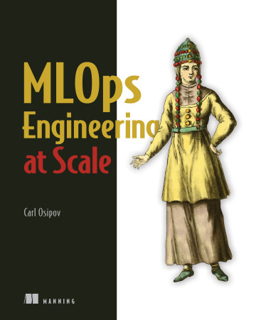

# Open Data Science Conference (ODSC) London 2022
# Automatic Differentiation Explained 
### using Python with an application to linear regression solved using gradient descent

by <a href="mailto:carl.osipov@gmail.com"><b>Carl Osipov</b></a>, based on the materials from his <a href="https://bit.ly/mlops-book"><b>"MLOps Engineering at Scale"</b></a>.

| Topic | Demo |
|---------|-------------|
| Automatic Differentiation |  

# [MLOps Engineering at Scale](https://www.amazon.com/Cloud-Native-Machine-Learning-Osipov/dp/1617297763)
## by Carl Osipov

[
